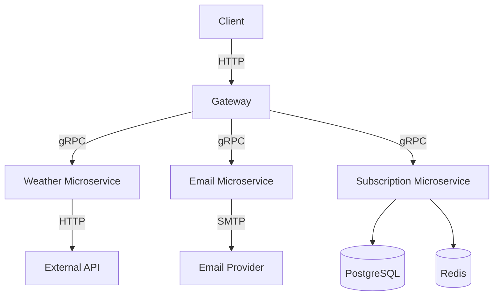

# System Design Document

**Project Name:** Weather Subscription API

**Project Description:** A system that allows users to subscribe to weather updates for specific locations, providing real-time notifications. The system can also provide weather data outside of the subscription.

## 1. Requirements

### Functional Requirements

- Users can subscribe to weather updates for specific locations.
- System must provide specific weather data: temperature, humidity and description.
- System can send real-time notifications via email (hourly and daily).
- Users can unsubscribe from weather updates.
- Users can request current weather data for any location.
- API must support both subscription management and direct weather requests.
- System must send confirmation emails for subscription validation.

### Non-Functional Requirements

- **Performance:** < 300ms response time for requests.
- **Scalability:** Must handle up to 10,000 concurrent users.
- **Availability:** 99.9% uptime.
- **Security:** Email confirmation for subscriptions & data validation.
- **Maintainability:** Code should be modular and well-documented.
- **Reliability:** Must handle failures gracefully and retry operations when necessary.

### Constraints

- Budget: free or minimal cost for hosting infrastructure.
- External API rate limits (Weather API): 1M requests/month.
- Limited team resources: Development is handled by solo developer, so architectural simplicity and maintainability are critical.
- GDPR Compliance: System must allow users to opt out and delete their data.

## 2. Load assessment

### Users and bandwidth

- **Active users:** Up to 10,000 concurrent users (of these ~4,500 simply use API).
- **API requests:** Up to 1000 requests per second.
- **Email notifications:** Up to 100,000 emails per day (hourly and daily updates).
- **Subscriptions per user:** only one.

### Data

- **Weather size:** ~800 bytes.
- **Email size:** ~2KB per email.
- **Subscription data (in DB):** ~200 bytes per user.
- **Total size**: ~72 GB/year.

### Bandwidth

- **Incoming requests:** ~800 KB/sec.
- **Outgoing responses:** ~1.6 MB/sec (including emails).
- **External API calls:** ~50 MB/sec (Weather API).

## 3. High-Level Architecture

## 4. Components

### 4.1 Gateway

- **Responsibilities:**
  - Acts as the entry point for all client requests.
  - Routes requests to appropriate microservices using gRPC.
  - Provides a unified API for clients.
- **Endpoints:**
  - `GET /api/weather?city=`: Retrieve current weather data for a specific city.
  - `POST /api/subscribe`: Register a new weather subscription for a user.
  - `GET /api/confirm/:token`: Confirm the user's subscription via a token sent by email.
  - `GET /api/unsubscribe/:token`: Cancel an existing subscription using a link.
- **Technologies:**
  - NestJS with TypeScript.
  - gRPC for communication with microservices.
  - Class-validator for request validation.
  - Class-transformer for enum transforming.
  - HTTP Exception filter for global error handling.

## 4.2 Weather Microservice

- **Responsibilities:**
  - Fetches current weather data from an external API (WeatherMap).
  - Provides weather data to the Gateway.
  - Check if the requested city is valid.
- **gRPC methods:**

| Method         | Description                             | Request Fields | Response Fields                                           |
|----------------|-----------------------------------------|----------------|-----------------------------------------------------------|
| **CityExists** | Check if a city is supported by the API | `city: string` | `exists: bool`                                            |
| **Get**        | Get current weather and forecast        | `city: string` | `current: GetDayResponse`, `forecast[]: GetDayResponse[]` |

  - GetDayResponse structure:

| Field         | Type   | Description            |
|---------------|--------|------------------------|
| `date`        | string | Date of the weather    |
| `temperature` | string | Average temperature °C |
| `humidity`    | string | Average humidity (%)   |
| `icon`        | string | Icon path or code      |
| `description` | string | Weather condition text |

- **Technologies:**
  - NestJS with TypeScript.
  - gRPC for communication with Gateway.
  - Fetch for external API calls.

### 4.3 Subscription Microservice

- **Responsibilities:**
  - Manages user subscriptions to weather updates.
  - Communicates with PostgreSQL for subscription data storage.
  - Generates confirmation tokens and manages Redis for token storage.
- **gRPC methods:**

| Method              | Description                                | Request Fields               | Response Fields                           |
|---------------------|--------------------------------------------|------------------------------|-------------------------------------------|
| **FindByFrequency** | Get all subscriptions with given frequency | `frequency: string`          | `subscriptions[]: { email, city, token }` |
| **EmailExists**     | Check if email already has a subscription  | `email: string`              | `exists: bool`                            |
| **Create**          | Create a new subscription                  | `email`, `frequency`, `city` | `token: string`                           |
| **TokenExists**     | Check if a token is valid                  | `token: string`              | `exists: bool`                            |
| **Confirm**         | Confirm a subscription via token           | `token: string`              | `message: string`                         |
| **Unsubscribe**     | Cancel subscription using token            | `token: string`              | `message: string`                         |

- **Database Schema:**
  - `subscriptions` table:
    - `id`: UUID (Primary Key)
    - `email`: VARCHAR (Unique)
    - `city`: VARCHAR
    - `frequency`: ENUM ('HOURLY', 'DAILY')
    - `token`: VARCHAR (Unique)
  
- **Technologies:**
  - NestJS with TypeScript.
  - gRPC for communication with Gateway.
  - Prima ORM for PostgreSQL interactions.
  - Redis for token management.

### 4.4 Email Microservice

- **Responsibilities:**
  - Sends confirmation emails for new subscriptions.
  - Sends weather updates based on user subscriptions.
- **gRPC methods:**

| Method               | Description                                   | Request Fields                                                                              | Response   |
|----------------------|-----------------------------------------------|---------------------------------------------------------------------------------------------|------------|
| **SendConfirmation** | Send a confirmation email with a token        | `email: string`, `token: string`                                                            | `Empty {}` |
| **SendForecast**     | Send a weather forecast email to a subscriber | `email: string`, `token: string`, `current: SendDayRequest`, `forecast[]: SendDayRequest[]` | `Empty {}` |

  - SendDayRequest structure:

| Field         | Type   | Description            |
|---------------|--------|------------------------|
| `date`        | string | Date of the weather    |
| `temperature` | string | Average temperature °C |
| `humidity`    | string | Average humidity (%)   |
| `icon`        | string | Icon path              |
| `description` | string | Weather condition text |

- **Email Templates:**
  - Confirmation email template with a link to confirm subscription (`confirmation.hbs`).
  - Weather update email template with current weather and forecast (`forecast.hbs`).

- **Technologies:**
  - NestJS with TypeScript.
  - gRPC for communication with Gateway.
  - Nodemailer for sending emails via SMTP.

### 4.5 Shared Components

  - **Shared Types:**
    - Common response types used across microservices.
    - Interfaces for gRPC requests and responses.
  - **Shared proto files:**
    - `.proto` files defining gRPC services and messages.
    - Used for code generation in each microservice.

## 5. Security Design

- **Authentication:** No user authentication required; system is public-facing.
- **Validation:** All inputs are validated using class-validator to prevent invalid data and injections.
- **Email Confirmation:** Subscription requires email confirmation to prevent spam and ensure valid subscriptions (valid up to 15 min).
- **Environment Variables:** Sensitive data (API keys, database credentials) are stored in `.env` files and not hardcoded.

## 6. Deployment Architecture

### Containerization
  - Each microservice and the gateway are containerized using Docker.
  - Docker Compose is used for fast deployment, it includes services for:
    - Gateway
    - Weather Microservice
    - Subscription Microservice
    - Email Microservice
    - PostgreSQL database
    - Redis in-memory database
    - Watchtower for hot-reloading during development

### Deployment
  - The system is hosted on a cloud provider (Azure VM).
  - Docker images can be deployed using Docker Compose or Kubernetes for orchestration.

## 7. Testing Strategy

**Unit Tests:** Gateway microservice has unit tests for business logic using Jest.

## 8. Future Enhancements

- **User Accounts & Authentication:**
  - Add optional user registration and login to manage subscriptions via dashboard.
  - Allow multiple subscriptions per user once authentication is in place.
- **Admin Panel:**
  - Interface to monitor active subscriptions, failed email deliveries, and usage stats. 
  - Manual override or resend confirmation links.
- **Multilingual Support:**
  - Add weather description translations. 
  - Allow users to select preferred language when subscribing.
- **Web Interface:**
  - Build a simple web interface for subscription management, weather viewing, and unsubscription.
- **Weather Alert Triggers:**
  - Send automatic notifications for severe weather.
- **Testing**:
  - Add integration tests for gRPC endpoints.
  - Implement end-to-end tests for the entire flow from subscription to email delivery.
- **Logging & Monitoring:**
  - Integrate tools like Prometheus + Grafana for metrics and error tracking.
